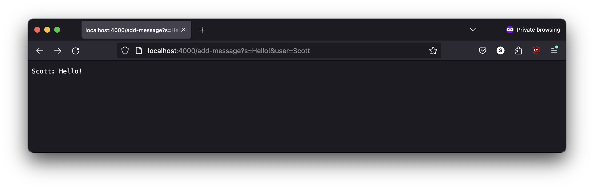
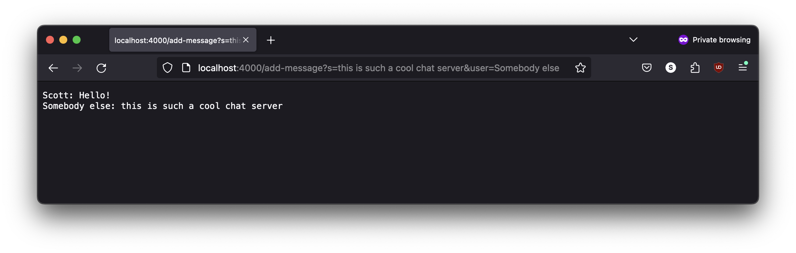
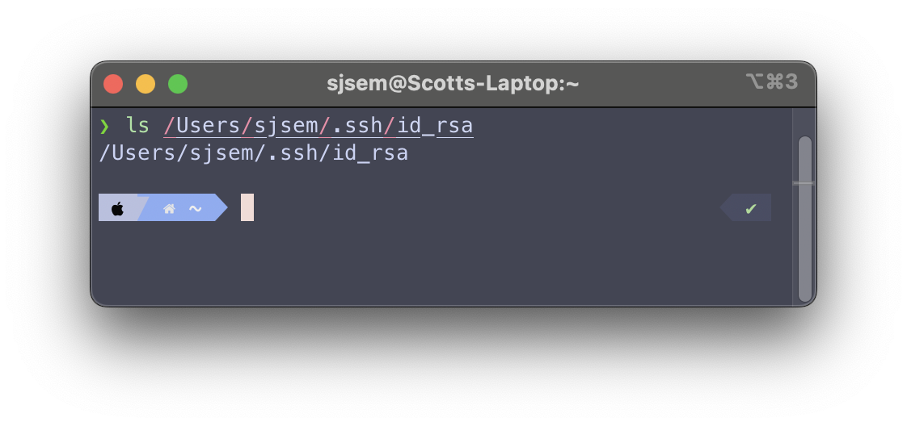
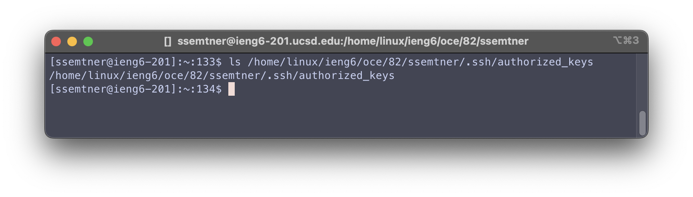
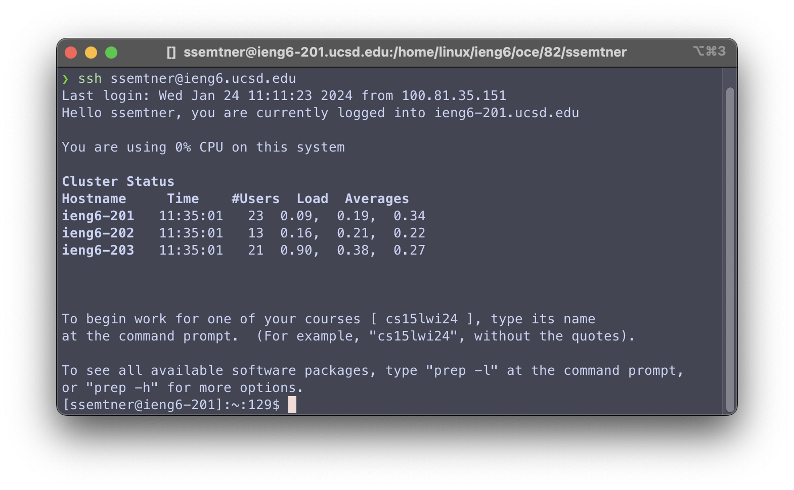

# Lab Report 2

## Part 1
Part 1 involved writing a chat server implementation.

This is the code I came up with:

```java
import java.io.IOException;
import java.net.URI;

class Handler implements URLHandler {
    private String string;

    public Handler() {
        string = new String();
    }

    public String handleRequest(URI url) {
        String path = url.getPath();

        if (path.equals("/")) {
            return string;
        } else if (path.equals("/add-message")) {
            String query = url.getQuery();
            String msg = null;
            String user = null;

            try {
                String[] params = query.split("&");
                for (String param : params) {
                    String[] parts = param.split("=");
                    if (parts[0].equals("s")) {
                        msg = parts[1];
                    } else if (parts[0].equals("user")) {
                        user = parts[1];
                    }
                }
            } catch (ArrayIndexOutOfBoundsException e) {
                return "Invalid query parameters\nExpected: s and user\n";
            }

            if (msg == null || user == null) {
                return "Invalid query parameters\nExpected: s and user\n";
            }

            string = String.format("%s%s: %s\n", string, user, msg);

            return string;
        }

        return "404 Not Found\n";
    }
}

class ChatServer {
    public static void main(String[] args) throws IOException {
        if (args.length == 0) {
            System.out.println("Missing port number");
            return;
        }

        int port = Integer.parseInt(args[0]);

        Server.start(port, new Handler());
    }
}
```

*This relies on the Server.java file [here](https://github.com/ucsd-cse15l-f23/wavelet)*

### The `/add-message` endpoint



When this endpoint is accessed, the `Server` class will call `Handler.handleRequest`,
which is the only method in my code called.

The method is called with the `url` argument set to a value of
`new URI("http://localhost:4000/add-message?s=Hello!&user=Scott")`.
At that point, the field `string` has the value `""` from the constructor.


After the request, the `string` field will have updated to `"Scott: Hello!\n"`;



For this request, the `Server` will call `Handler.handleRequest` again,
which is still the only method from my code called.

The `url` argument will have a value of
`new URI("http://localhost:4000/add-message?s=this is such a great chat server wow!&user=Someone else")`.
The `string` field will be equal to `"Scott: Hello!\n"` from the previous request.


After the request is completed, the field `string` will be
`"Scott: Hello!\nSomeone else: this is such a great chat server wow!\n"`;

## Part 2

### Private Key



### Public Key



### Accessing `ieng6.ucsd.edu`



## Part 3

Something that I learned ... TODO
