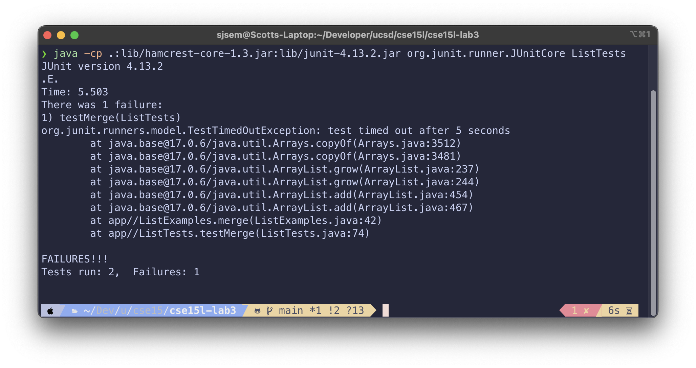

# Lab Report 3

## Part 1: Bugs

In the week 4 lab, we searched for bugs in multiple example programs.
This is a explanation of one of the bugs in the `merge` method in a `ListExamples` class.

### Failure inducing JUnit test

```java
// Time out tests after 5 seconds
@Rule
public Timeout timeout = Timeout.seconds(5);

@Test
public void testMerge() {
    ArrayList<String> input1 = new ArrayList<>();
    input1.add("apple");
    input1.add("orange");
    input1.add("strawberry");

    ArrayList<String> input2 = new ArrayList<>();
    input2.add("attack");
    input2.add("battle");
    input2.add("locate");
    input2.add("yonder");

    assertArrayEquals(
            new String[] {
                "apple",
                "attack",
                "battle",
                "locate",
                "orange",
                "strawberry",
                "yonder"
            },
            ListExamples.merge(input1, input2).toArray());
}
```

### JUnit test that passes

```java
@Test
public void testMergePasses() {
    ArrayList<String> input1 = new ArrayList<>();
    input1.add("apple");
    input1.add("orange");
    input1.add("strawberry");

    ArrayList<String> input2 = new ArrayList<>();
    input2.add("attack");
    input2.add("battle");

    assertArrayEquals(
            new String[] {
                "apple", "attack", "battle", "orange", "strawberry"
            },
            ListExamples.merge(input1, input2).toArray());
}
```

### The symptom

To find the symptom, I ran the both JUnit tests and one timed out.
That led me to believe there was an infinite loop somewhere in the `merge` method when input1 has more elements than input 2.



### The bug

The bug turned out to be in a while loop in the `merge` method of `ListExamples`.

```java
static List<String> merge(List<String> list1, List<String> list2) {
  List<String> result = new ArrayList<>();
  int index1 = 0, index2 = 0;
  while(index1 < list1.size() && index2 < list2.size()) {
    if(list1.get(index1).compareTo(list2.get(index2)) < 0) {
      result.add(list1.get(index1));
      index1 += 1;
    }
    else {
      result.add(list2.get(index2));
      index2 += 1;
    }
  }
  while(index1 < list1.size()) {
    result.add(list1.get(index1));
    index1 += 1;
  }
  while(index2 < list2.size()) {
    result.add(list2.get(index2));
    index1 += 1; // <-- The bug is here
  }
  return result;
}
```

In a while loop with a condition depending on index2, the index1 variable is incremented instead of index2.
When index2 never changes, the while loop will run infinitely, which is what caused the JUnit test to time out.

After fixing the bug, the method is as follows.

```java
static List<String> merge(List<String> list1, List<String> list2) {
  List<String> result = new ArrayList<>();
  int index1 = 0, index2 = 0;
  while(index1 < list1.size() && index2 < list2.size()) {
    if(list1.get(index1).compareTo(list2.get(index2)) < 0) {
      result.add(list1.get(index1));
      index1 += 1;
    }
    else {
      result.add(list2.get(index2));
      index2 += 1;
    }
  }
  while(index1 < list1.size()) {
    result.add(list1.get(index1));
    index1 += 1;
  }
  while(index2 < list2.size()) {
    result.add(list2.get(index2));
    index2 += 1; // <-- Changed to index2
  }
  return result;
}
```

After the fix, all of my JUnit tests pass.

## Part 2: Grep Options

These are some interesting options for `grep`.

All examples use the `technical/` directory in [this repository](https://github.com/ucsd-cse15l-s23/docsearch)

### Invert match

*Source: grep man page*

Running grep with the `-v` or `--invert-match` flag will return every line that does **not** match the pattern provided.

This is useful when you are trying to exclude some search term and it would take much longer to find what you are searching for instead of what you are excluding.

#### Example 1: finding all lines without an "e" in a file

```
〉 grep -v "e" technical/biomed/cc973.txt


        Introduction
        fluctuating [ 6].


        hospital [ 7].
        in SPSS for Windows (MIcrosoft, Washington, USA) for APACHE


        20.1 ± 2.7 [
        8.1 ± 1.2 [
        mortality.


        Discussion


〉

```

The command is using the invert option to return every line in the `cc973.txt` file.
Every blank line in the file is part of the output because they have no characters to match.

#### Example 2: finding files in directory that do not contain an underscore

```
〉 find technical/government/Media -type f | grep -v "_"
technical/government/Media/BusinessWire2.txt
technical/government/Media/GreensburgDailyNews.txt
technical/government/Media/BusinessWire.txt
technical/government/Media/BergenCountyRecord.txt
technical/government/Media/RoanokeTimes.txt
technical/government/Media/Survey.txt
technical/government/Media/Understanding.txt
technical/government/Media/FortWorthStarTelegram.txt
technical/government/Media/CommercialAppealMemphis2.txt
〉
```

The output of the find command being piped to grep is a long list of files in the `Media` subfolder.
The `-v` option in grep makes it easy to see what does not contain and `_` character, which could be useful to find one word file names or improperly named files, if you are using snake case.

### Files with matches

*Source: grep man page*

Using the `-l` or `--files-with-mathes` flag with grep will return the name of the file with a match instead of the match itself.

This is useful when you want to do something with files that contain a pattern, rather than seeing the matches themselves.

#### Example 1: finding all files that contain the term "RNA strand"

```
〉 grep "RNA strand" technical/biomed/*.txt -l
technical/biomed/1471-2164-3-31.txt
technical/biomed/1471-2180-1-12.txt
technical/biomed/1472-6750-2-14.txt
〉
```

The `-l` option makes grep only return the relative paths to the files that match,
which could be useful for performing operations on those files in the future.

#### Example 2: finding all the files that contain a line ending with a specific pattern

```
〉 grep -l "[a-z][A-Z][0-9]$" technical/biomed/*.txt
technical/biomed/1471-2091-4-5.txt
technical/biomed/1471-2121-3-15.txt
technical/biomed/1471-2156-2-5.txt
technical/biomed/1471-2164-3-26.txt
technical/biomed/1471-2172-4-2.txt
technical/biomed/1471-2202-2-15.txt
technical/biomed/1471-2202-2-7.txt
technical/biomed/1471-2210-1-7.txt
technical/biomed/1472-6793-1-11.txt
technical/biomed/1472-6793-1-15.txt
technical/biomed/1472-6793-1-8.txt
technical/biomed/1475-2867-3-4.txt
technical/biomed/1477-5956-1-1.txt
technical/biomed/ar149.txt
technical/biomed/ar383.txt
〉
```

This examples combines the `-l` option with more complex ways to match with grep.
Specifically, this command will return the name on any file in the `biomed` directory that has
any line in it that ends with a lowercase letter (`[a-z]`),
an uppercase letter (`[A-Z]`), then a digit (`[0-9]`).

### Only matching

*Source: grep man page*

The `-o` or `--only-matching` flag makes grep only return the matched parts of a line.
Each part is returned as a new output line.

This is useful when you want to perform operation on only what you are matching, like if you matched file paths and wanted to use them in another command.

#### Example 1: find 4 letter words that start with "the"

```
〉 grep -o " the[a-z] " technical/government/Env_Prot_Agen/final.txt
 they
 them
 they
 they
 then
 them
〉
```

This example uses a pattern match any word that starts with "the" and ends with any lowercase letter.
It searches in one file, and the output shows the variations of words that match the pattern.

A big limitation of this example is that it defines a word as being surrounded by spaces, which is incorrect.

#### Example 2: counting the occurences of a word across a directory

```
〉 grep -o "the" technical/plos/*.txt | wc -l
27924
〉
```

This example uses grep with the `-o` option to output a new match for every time "the" occurs in the entire `technical/plos` directory.
That is then piped into `wc -l` to count the number of lines in the output, which coresponds to count of the word "the".

This is probably not the most efficient way to count the occurences of a word,
but is works and it a good demonstration of the capabilities of grep.
