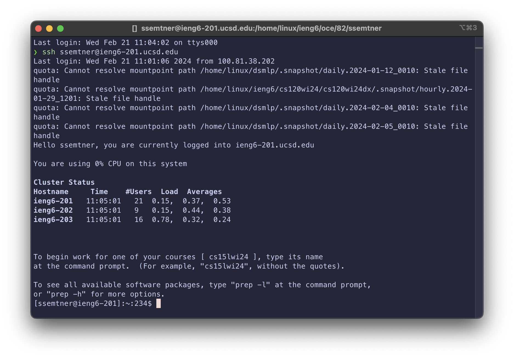
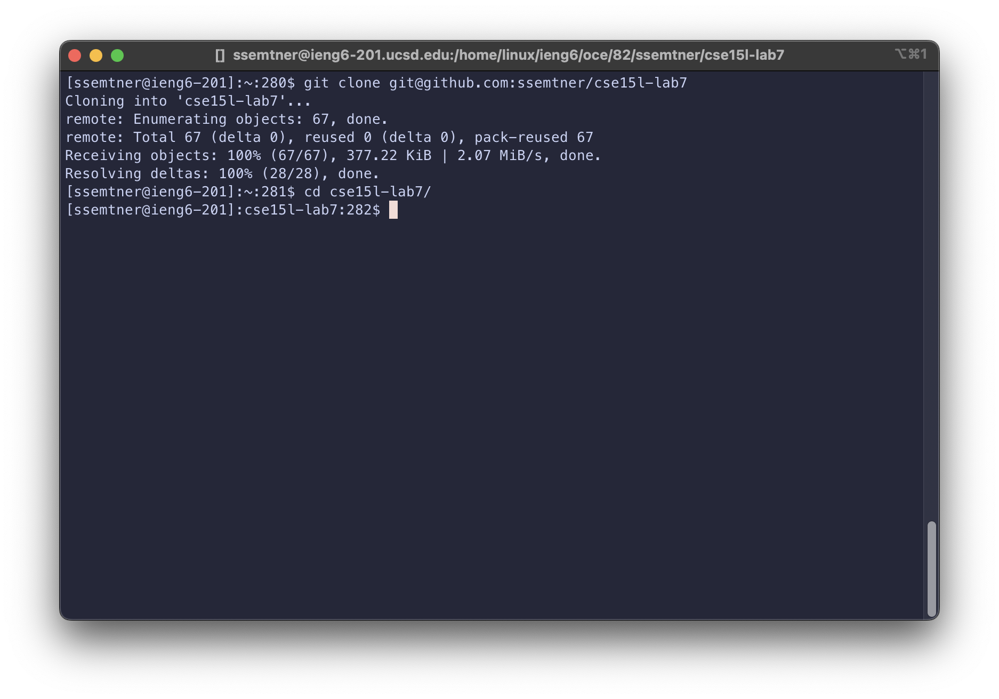
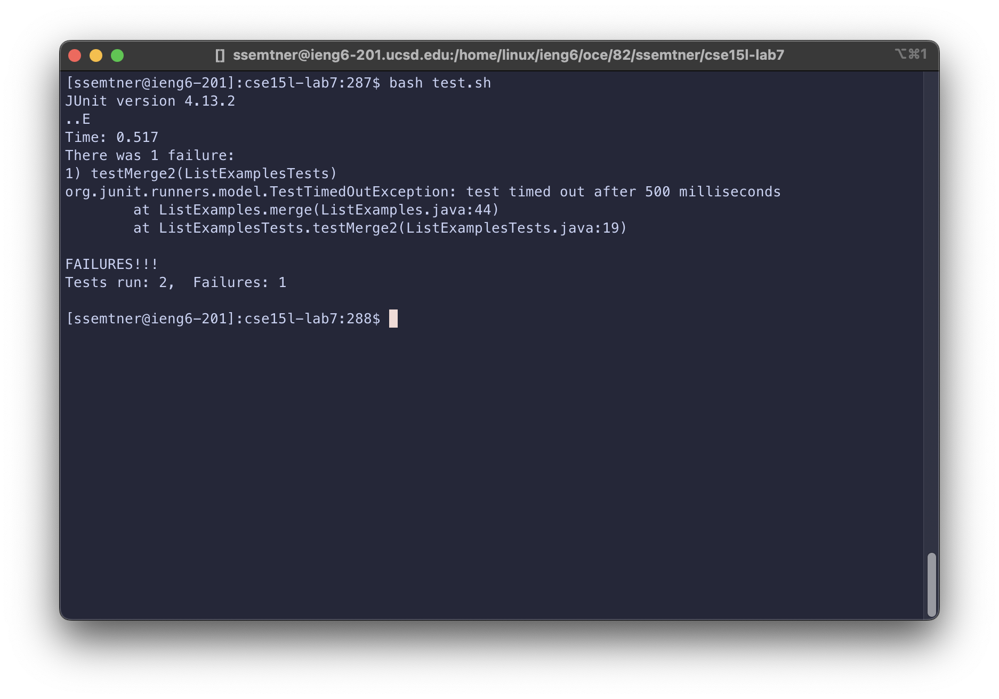
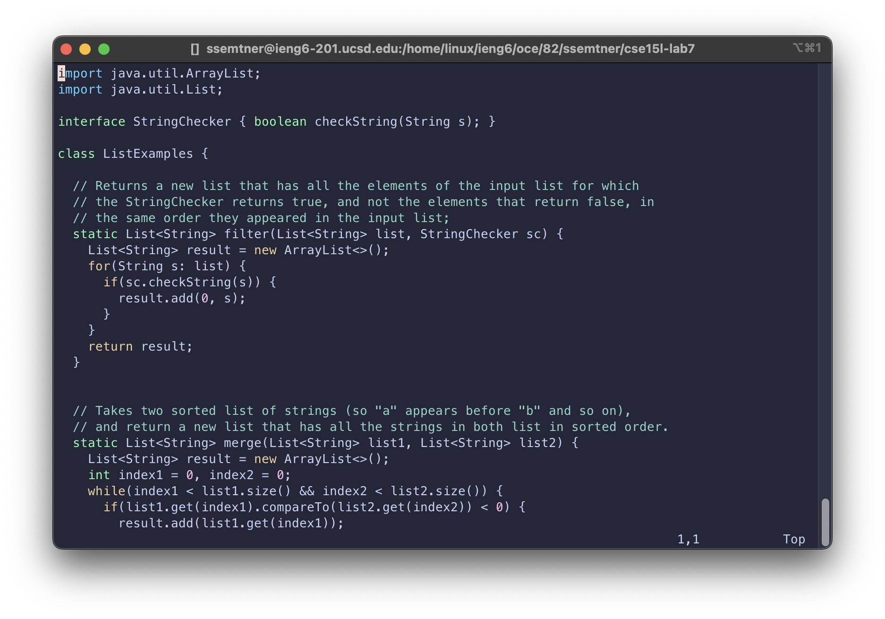
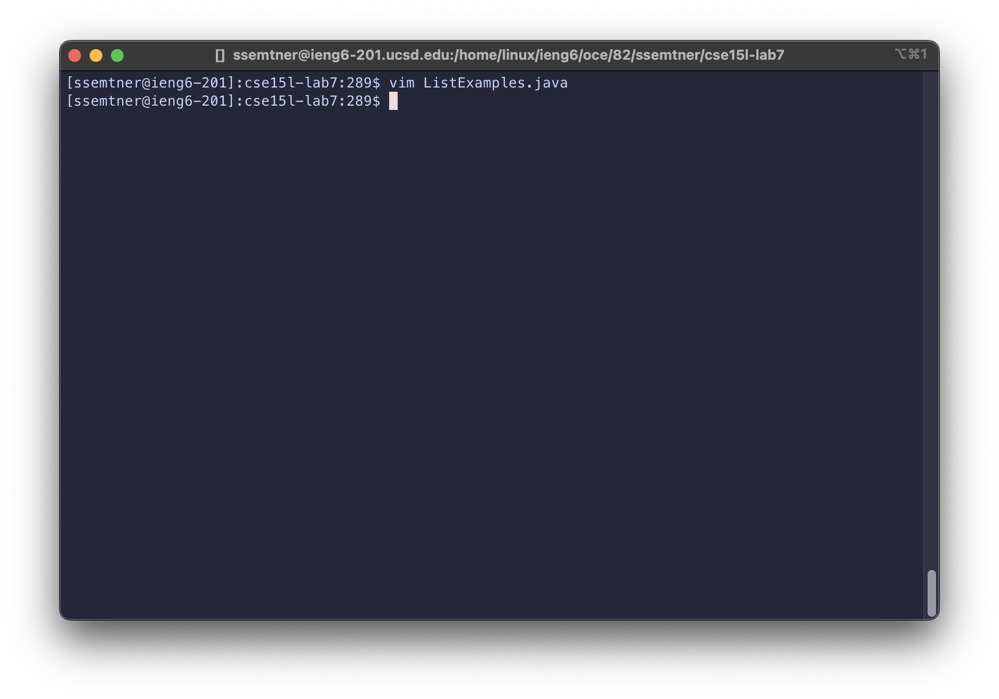
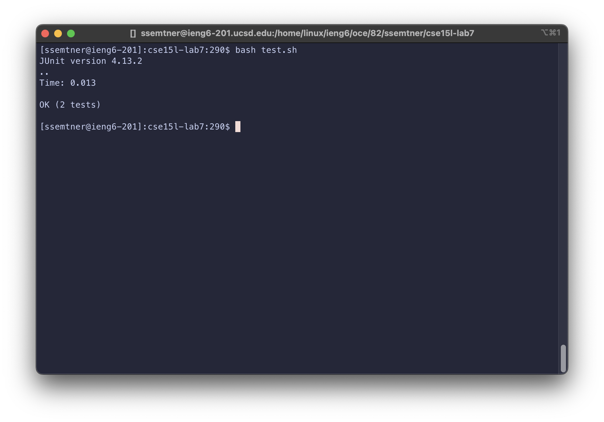
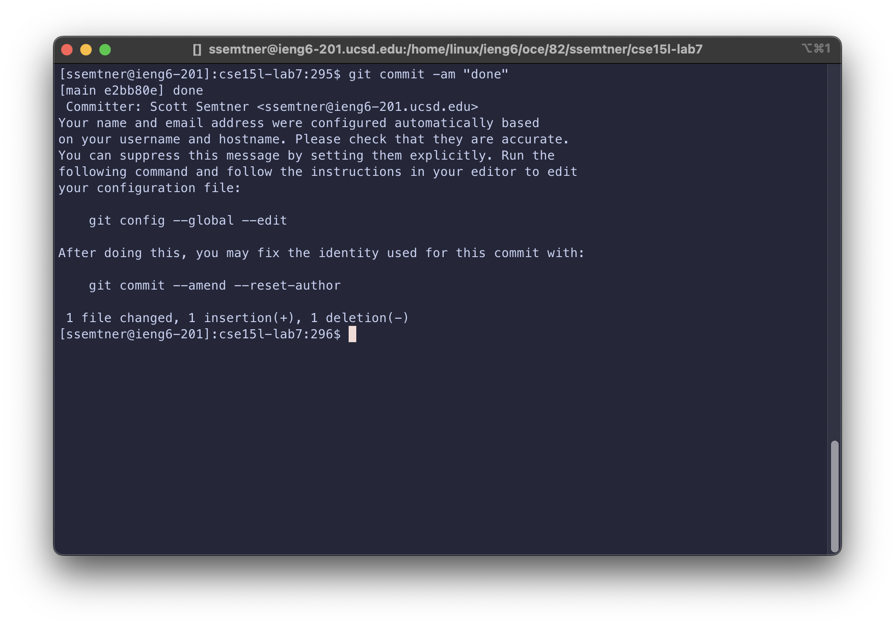
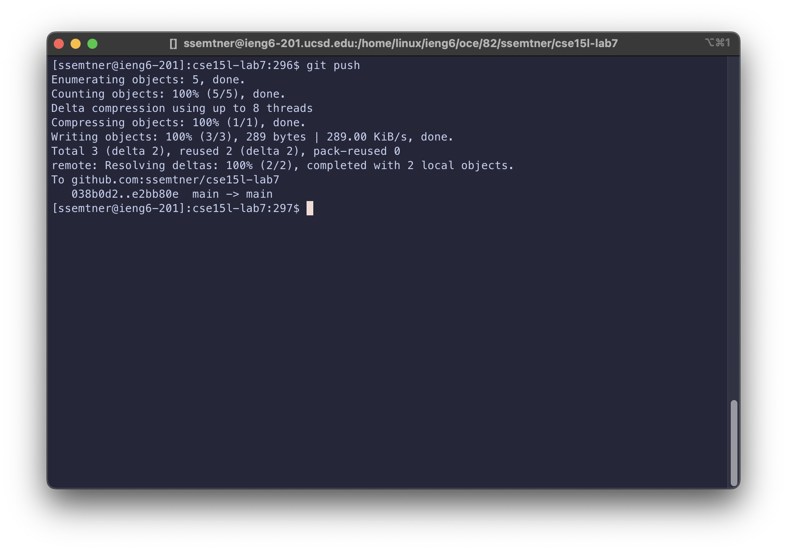

# Lab Report 4

## Reproducing the time trial from lab

This is a step by step walkthrough of how I did the time trial task from lab, starting with step 4.

### Step 4

**Log into ieng6**

Keys pressed: `<Up><Enter>`. My last command in my local terminal was `ssh ssemtner@ieng6-201.ucsd.edu`, so I ran that again.

### Step 5

**Clone the repository**

Keys pressed: `<Ctrl-r>clo<Enter>`. I searched through my command history for the command `git clone git@github.com:ssemtner/cse15l-lab7` which I ran previously.
`clo` was enough to match it, so I pressed enter to run the command.

To enter the directory, I pressed the keys `cd cs<Tab><Enter>` to tab complete the directory name and move into it.

### Step 6

**Run the failing tests**

Keys pressed: `bash te<Tab><Enter>`. For this step, I figured that I can type `bash` quick enough, and I used tab completion after `te` to match `test.sh`, before running the command.

### Step 7

**Edit the code**

Keys pressed to enter vim: `<Ctrl-r>vim<Enter>`. I used the history search again to find and run my last vim command, which was `vim ListExamples.java`.

Keys pressed in vim: `G6ker2:wq`. The line that needs to be changed is near the bottom of the file, so I pressed `G` to move my cursor to the last line. The next part is `6k` which moves my cursor up (`k`) 6 lines. Next, I used `e` to go to the end of the current word, `index1`, which placed my cursor over the `1`. `r2` replaced the 1 with a 2. Finally, `:wq` saves and exits vim.

### Step 8

**Run the tests again**

Keys pressed: `<Up><Up><Enter>`. I last ran `bash test.sh` 2 commands ago, so I used the up arrow to find that command and ran it again.
At this point, the tests all pass.

### Step 9

**Commit and push the changes**

Keys pressed: `<Ctrl-r>com<Enter>`. Similar to the previous steps, I used searched my command hisotry to find and run my last `git commit` command, which was `git commit -am "done"`. The `-a` flag stages all changes, so I don't have to run `git add` first.

Finally, I typed out `git push<Enter>` to push the changes to the remote repository.
