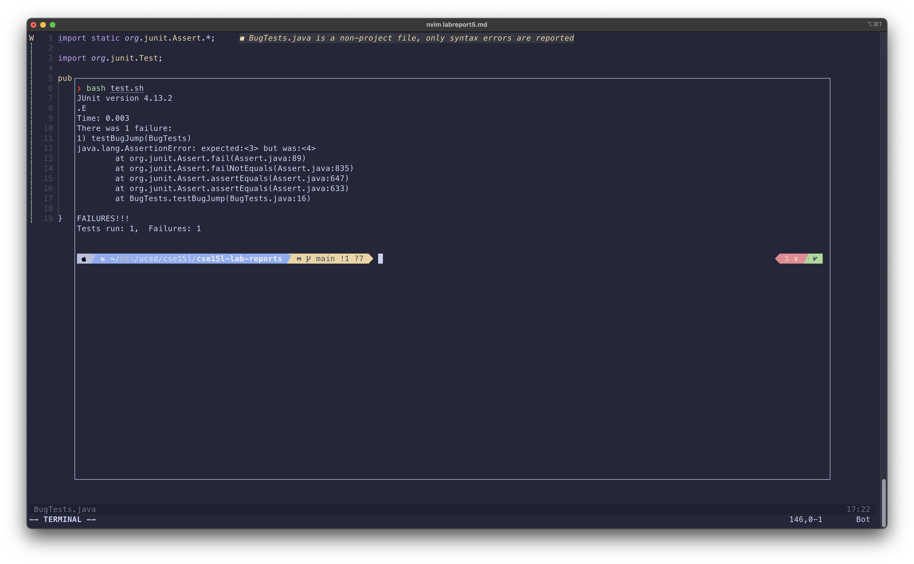
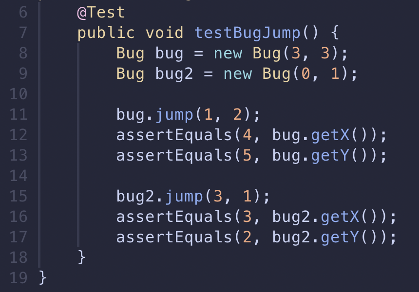

# Lab Report 5

## Part 1: Debugging Scenario

### A Hypothetical EdStem conversation

**Student:**

> Hi! I'm having trouble with the jump method of the bug class.
> It's failing the testJump test case and I'm not sure how it is returning 1.
> My input is starting the Bug at (3, 3) and running jump(1, 2).
> Here's a screenshot:



**TA:**

> Sorry, I don't think we have enough information to help you yet.
> Could you provide what your test case is and where it is failing as well as the jump method?
> Because you say it is returning 1 and you are not sure why, you could try to identify any inputs across your test that might result in 1.

**Student:**

> Thanks for the help! Here is a screenshot of my test case and the jump method.
> I created a second bug in the test case that has a one in the x position but how would that affect the first bug?




#### All the information

##### File structure

```
root
|- Bug.java
|- BugTests.java
|- test.sh
```

##### Contents of each file

Bug.java

```java
public class Bug {
    private static int x, y;

    public Bug() {
        x = 0;
        y = 0;
    }

    public Bug(int x, int y) {
        this.x = x;
        this.y = y;
    }

    public void jump(int dx, int dy) {
        x += dx;
        y += dy;
    }

    public int getX() {
        return x;
    }

    public int getY() {
        return y;
    }
}
```

BugTests.java

```java
import static org.junit.Assert.*;

import org.junit.Test;

public class BugTests {
    @Test
    public void testBugJump() {
        Bug bug = new Bug(3, 3);
        Bug bug2 = new Bug(0, 1);

        bug.jump(1, 2);
        assertEquals(4, bug.getX());
        assertEquals(5, bug.getY());

        bug2.jump(3, 1);
        assertEquals(3, bug2.getX());
        assertEquals(2, bug2.getY());
    }
}
```

test.sh

```bash
set -e

javac -cp :lib/junit-4.13.2.jar:lib/hamcrest-core-1.3.jar Bug.java BugTests.java
java -cp :lib/junit-4.13.2.jar:lib/hamcrest-core-1.3.jar org.junit.runner.JUnitCore BugTests
```

##### Commands to trigger the bug

Running the test script: `bash test.sh`

##### How to fix the bug

The bug is that `x` and `y` are declared as static variables, which makes them shared across all instances of the `Bug` class.
That is why when the second bug is created, all bugs now share the position `x=0, y=1`.

To fix the bug, remove the `static` keyword from `Bug.java`.

## Part 2: Reflection

I think the most important thing I learned in the second half of this quarter was how to use jdb.
I don't have any experience using command line debuggers so it felt very productive to learn.
It was also the most engaging part because there was a lot of trial and error involved, like when figuring out that you can't set a breakpoint on a blank line.
